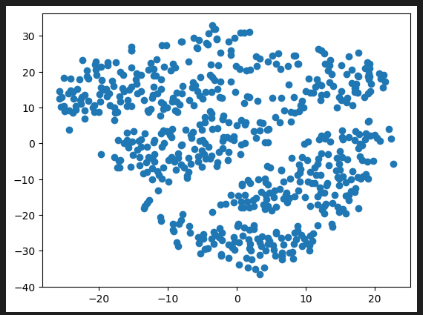
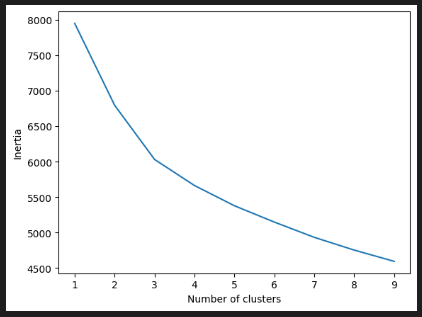

# Unsupervised Machine Learning Challenge
This project uses several clustering algorithms to explore whether patients can be placed into distinct groups for predicting myopia, or nearsightedness. Raw data on myopia is scaled and dimensionality reduced to better fit machine learning models. The output of the K-Means algorithm indicates the number of patient clusters in this dataset.

## Tools and Libraries
* Python
* Jupyter Notebook
* Pandas
* Matplotlib.pyplot
* SKLearn
  * StandardScaler
  * KMeans
  * PCA
  * TSNE

## Dataset
[myopia.csv](myopia.csv)

## Method
1. Prepare the Data
   * Read data into DataFrame
   * Remove 'MYOPIC' column from dataset
   * Standardize dataset using StandardScaler
2. Apply Dimensionality Reduction
   * Perform dimensionality reduction with PCA, with an explained variance of 90%
   * Reduce dimensionality with t-SNE to visualize the physical components of the PCA output
   * Create a scatter plot of the t-SNE output
3. Perform a Cluster Analysis with K-Means
   * Create an elbow plot to determine the optimal k value indicating the number of clusters in the dataset

## Recommendation
Figure 1 - t-SNE:

Figure 2 - K-means:

Based on the K-Means elbow curve, the patients can be grouped into three clusters. This finding is supported by the clustering visible in the scatter plot based on the t-SNE output, which shows three diagonal bands.

